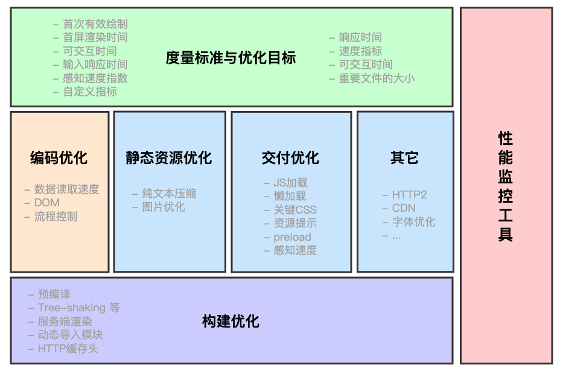

# WEB前端

### 熟悉微前端应用并落地项目中

主要是使用它将一个Angular项目在不影响用户使用的情况下，过渡为Vue开发的项目。使用single-spa-angular和single-spa-vue进行single-spa application的初始化和挂载等。
   
1. 使用了import-map-overrides来实现本地开发过程中只需要启动新的Vue项目。

2. 使用parcels在不同框架之间共享UI或组件，使用Utility公共模块实现通用逻辑和部分的数据通信。

3. 实现了不同项目的独立仓库，开发，部署集成。


Vue的微前端架构例子：[vue microfrontends](https://github.com/vue-microfrontends)


###  开发公司内部的UI库，NPM私有库

   为什么做这个？怎么做？别人怎么用？

### 前端异常监控

在我们的项目中我将页面异常分为以下几种情况：

- javascript异常（语法错误，运行时错误，跨域脚本）
- 资源加载异常（img js css）
- ajax请求异常
- promise异常
- vue项目中全局异常捕获

1. javascript异常


```js
// window.onerror捕获javascript异常
/**
* 捕获javascript异常
* @param {String}  message    错误信息
* @param {String}  source     出错文件
* @param {Number}  lineno     行号
* @param {Number}  colno      列号
* @param {Object}  error      Error对象（对象）
*/
window.onerror = function (message, source, lineno, colno, error){
    console.log('捕获到异常：', { message, source, lineno, colno,error });
}
```

客户端：涉及跨域的在`script`标签增加crossorigin="anonymous"[əˈnɑːnɪməs]

服务端：静态资源响应头`Access-Control-Allow-Origin: *`

2. 资源加载异常

```js
// 捕获资源加载异常,
window.addEventListener('error',function(e){
    const err = e.target.src || e.target.href
    if(err){
        console.log('捕获到资源加载异常',err)
    }
},true)
```
img加载异常时会触发img.onerror函数

3. ajax接口请求异常捕获

status!==200

4. promise异常捕获

有 `catch` 走 `catch` ,没有`catch`需要注册`window.addEventListener('unhandledrejection')`

```js
window.addEventListener('unhandledrejection', event => {
    console.log('捕获到未处理的promise异常',event.reson)
})

```

5. vue项目全局异常捕获

```js
Vue.config.errorHandler = function (err, vm, info) {
    // `info` 是 Vue 特定的错误信息，比如错误所在的生命周期钩子
    // 只在 2.2.0+ 可用
    let msg = `错误发生在：${info}中，具体信息：${err.stack}`
    console.log(msg)
}
```
最后，捕获异常之后，将异常上报，然后在管理系统页面列表查看，也可以做实时推送。

### 网页性能优化

