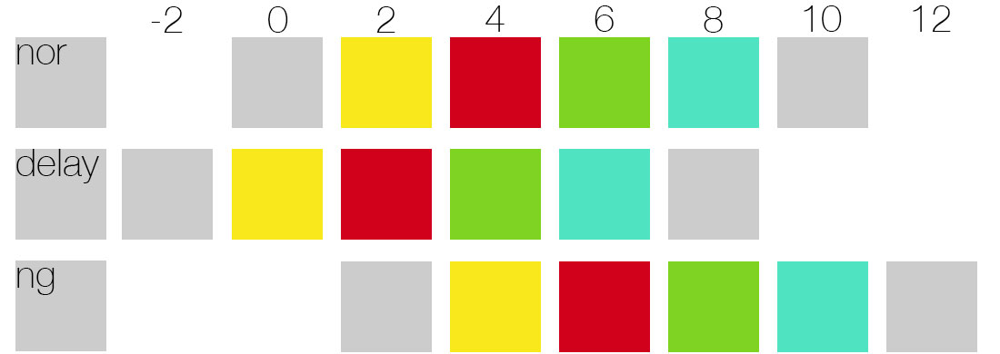

# CSS

## 动画

@keyframes

创建动画的原理是，将一套 CSS 样式逐渐变化为另一套样式。在动画过程中，您能够多次改变这套 CSS 样式。

以百分比来规定改变发生的时间，或者通过关键词 "from" 和 "to"，等价于 0% 和 100%。0% 是动画的开始时间，100% 动画的结束时间。

例如创建一个从左往右移动的动画：

```css
div
{
width:100px;
height:100px;
background:red;
position:relative;
animation:myfirst 1s forwards;
}

@keyframes myfirst
{
0%   {background: red; left:0px; top:0px;}

100% {background: blue; left:200px; top:0px;}
}
```

animation属性

用法：

```css
animation: name duration timing-function delay iteration-count direction;
```

1. animation-name

2. animation-duration：动画完成一个周期所需要的时间，以秒或毫秒计。

3. animation-timing-function：规定动画的速度曲线。也就是动画从一套 CSS 样式变为另一套所用的时间。
   - ease:：默认。动画以低速开始，然后加快，在结束前变慢。
   - linear：  动画从头到尾的速度是相同的。  
   - ease-in：   动画以低速开始。
   - ease-out：  动画以低速结束。
   - ease-in-out：   动画以低速开始和结束。
   - cubic-bezier(*n*,*n*,*n*,*n*)：在 cubic-bezier 函数中自己的值。可能的值是从 0 到 1 的数值。

4. animation-delay：动画开始前等待的时间，默认为0

   可以为负数。假设一个10s的动画，delay为-2s的情况如下：

   

5. animation-iteration-count：动画的播放次数。默认为1
   - n：自定义次数
   - infinite：无限次

6. animation-direction：动画是否应该轮流反向播放，如果动画播放次数为1，则该属性无效

   - normal：默认值
   - alternate：轮流反向播放

   

此外，动画还有两个属性。

7. animation-play-state：规定动画正在运行还是暂停，您可以在 JavaScript 中使用该属性，这样就能在播放过程中暂停动画。例如*object*.style.animationPlayState="paused"。
   - running：运行。默认值
   - paused：暂停

8. animation-fill-mode：规定动画在播放之前或之后，其动画效果是否可见。例如我们想保存动画结束之后的状态，而不是恢复原始位置，就设置为forwards
   - none：默认
   - forwards：当动画完成后，保持最后一个属性值
   - backwards：在 animation-delay 所指定的一段时间内，在动画显示之前，应用开始属性值（在第一个关键帧中定义）。
   - both：向前和向后填充模式都被应用。

## 转换transform

转换的所有6种属性如下：

1. transform

2. transform-origin

   用法:

   ```css
   transform-origin: x-axis y-axis z-axis;
   ```

​      参数值定义视图被置于 X/Y/Z轴的何处。可能的值：left、center、right、length、%。

3. transform-style：嵌套元素都有3D转换的时候，子元素的 3D 转换是否生效/保留

- flat：不保留，默认值
- preserve-3d：保留

4. perspective：透视效果。值为number/none，默认为none

5. perspective-origin：默认情况下，透视消失点位于元素的中心，但是可以通过设置 [`perspective-origin`](https://developer.mozilla.org/zh-CN/docs/Web/CSS/perspective-origin) 属性来改变其位置。

   用法:

   ```css
   perspective-origin: x-axis y-axis;
   ```

   参数可能的值：left、center、right、length、%。默认值:50%,50%

6. backface-visibility ：定义当元素背向屏幕时是否可见（例如Y轴旋转180度，我们看到的就是元素的背部），如果在旋转元素不希望看到其背面时，该属性很有用。
   - visible：可见
   - hidden：隐藏

**transform属性包含的方法和用法如下：**

用法：

```css
transform: translate(50px,100px);
```

- translate()

  translate(x,y)：沿着x轴、y轴移动

  translate3d(x,y,z)：沿着x轴、y轴、z轴移动

  translateX(n)：沿着x轴移动

  translateY(n)：沿着y轴移动

  translateZ(n)：沿着z轴移动

- rotate()

  rotate(angle)：2D旋转，参数是角度

  rotate3d(x,y,z,angle)：3D旋转

  rotateX(angle)：沿着X轴的3D旋转

  rotateY(angle)：沿着Y轴的3D旋转

  rotateZ(angle)：沿着Z轴的3D旋转

- scale()

  scale(x,y)：2D缩放，改变元素的宽高

  scale3d(x,y,z)：3D缩放

  scaleX(n)：改变元素的宽

  scaleY(n)：改变元素的高

  scaleZ(n)；改变元素的Z轴

- skew()

  skew(x-angle,y-angle)：倾斜转换，沿着x轴和y轴

  skewX(angle)：沿着x轴

  skewY(angle)：沿着y轴

- matrix()

  matrix(n,n,n,n,n,n)：使用六个值的矩阵

  matrix3D(n,n,n,n,n,n,n,n,n,n,n,n,n,n,n,n)：定义 3D 转换，使用 16 个值的 4x4 矩阵。

- perspective()

  perspective(*n*)：为 3D 转换元素定义透视视图。

## 过渡 transition

用法：

```css
transition: property duration timing-function delay;
```

例如：

```css
div
{
width:100px;
height:100px;
background:blue;
transition:width 2s ease 1s;
-moz-transition:width 2s ease 1s; /* Firefox 4 */
-webkit-transition:width 2s ease 1s; /* Safari and Chrome */
-o-transition:width 2s ease 1s; /* Opera */
}

div:hover
{
width:300px;
}
```

过渡的所有5种属性如下：

1. transition
2. transition-property:
   - all：所有属性都具有过渡效果，默认值
   - property：指定哪些属性，以逗号分隔。例如：width,height
   - none

3.  transition-duration ：过渡时长

4. transition-timing-function

   ```css
   transition-timing-function:linear|ease|ease-in|ease-out|ease-in-out|cubic-bezier(n,n,n,n);
   ```

5. transition-delay：延迟多久开始过渡

   

## CSS子元素宽度自动为父容器剩余宽度

``` css
/**猜测是flex布局的问题，进一步猜测省略符需要对父元素限定宽度。
尝试对父元素.content设置width: 100%无效，但是设置width: 0可行。
**/
.content{
  flex:1;
  width:0;
}
/**有一种方法可以达到效果：**/

.content {
  flex:1;
  overflow:hidden;
}

/**二种方法都可以达到我们需要的效果，即给 content 设置了 flex 为 1 的时候，它会动态的获得父容器的剩余宽度，且不会被自己的子元素把内容撑开。**/

```

## CSS超出显示省略号

``` css
overflow:hidden;
text-overflow:ellipsis;
white-space: nowrap;
```

这个存在浏览器兼容问题的。

## 原始格式

```css
 white-space: pre-wrap;
 word-break: break-all;
```

## 