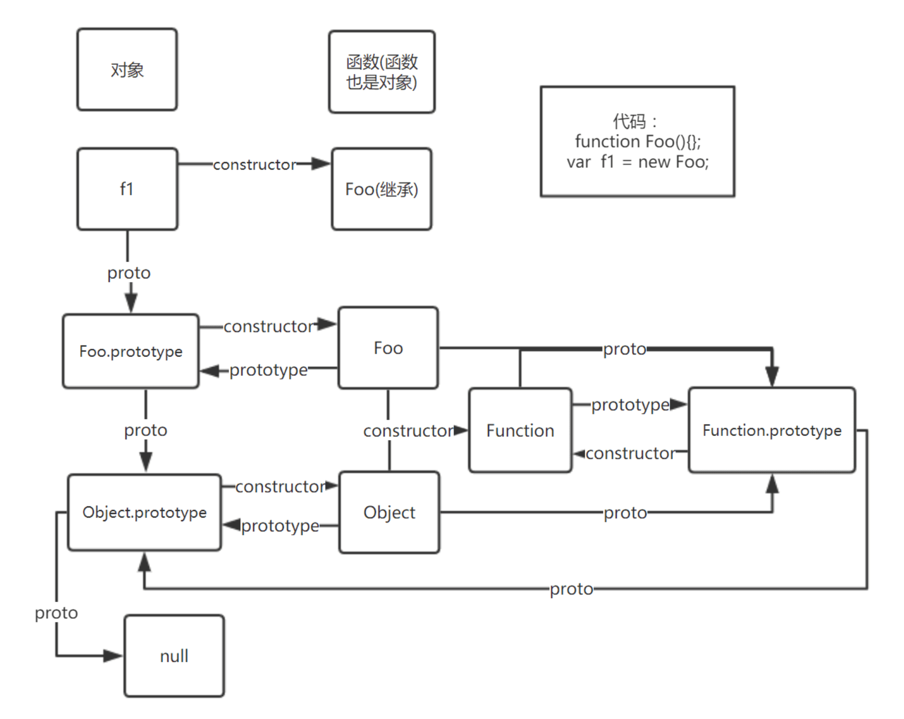

# Javascript

##  Object.assign()和深浅拷贝

1）浅拷贝

``` js
let user = {
    name: "John",
    age: 30
};

let cloneUser = Object.assign({}, user);
```

如果user里面有个属性为对象，那么assign对深层次的拷贝为对象地址的引用，例如：

``` js
let user = {
    name: "John",
    age: 30,
    sizes: {
        height: 182,
        width: 50
    }
};

let cloneUser = Object.assign({}, user);

user.sizes.width++;

console.log(cloneUser.sizes.width) // 51
```

这种嵌套对象的拷贝使用引用的方式拷贝的，称为“浅拷贝”。拷贝的是对象的引用（内存地址），而不是这个对象本身。

因此对这个引用的修改，都是作用在同一个对象上的，会导致你不想修改的对象也发生修改。

值类型（字符串，数字，布尔值）和引用类型。对值类型的拷贝都是直接拷贝原始值的，所以不会出现这个问题。

为了解决此问题，我们应该使用会检查每个 user[key] 的值的克隆循环，如果值是一个对象，那么也要复制它的结构。这就叫“深拷贝”。

我们可以自己实现，或者使用loadsh的_.cloneDeep()方法。

2）合并多个对象

``` js
let user = {
    name: "John"
};

let permissions1 = {
    canView: true
};
let permissions2 = {
    canEdit: true
};

let clone = Object.assign(user, permissions1, permissions2);

console.log(clone) // {name: "John",canView: true,canEdit: true}
```

如果被拷贝的属性的属性名已经存在，那么它会被覆盖。

``` js
let user = {
    name: "John"
};

Object.assign(user, {
    name: "Pete"
});

console.log(user.name) //'Pete'
```

## == 和=== 的区别

操作数1 == 操作数2，  操作数1 === 操作数2

比较过程：

　　双等号==： 

　　（1）如果两个值类型相同，再进行三个等号(===)的比较

　　（2）如果两个值类型不同，也有可能相等，需根据以下规则进行类型转换在比较：

　　　　1）如果一个是null，一个是undefined，那么相等

　　　　2）如果一个是字符串，一个是数值，把字符串转换成数值之后再进行比较


　　三等号===:

　　（1）如果类型不同，就一定不相等

　　（2）如果两个都是数值，并且是同一个值，那么相等；如果其中至少一个是NaN，那么不相等。（判断一个值是否是NaN，只能使用isNaN( ) 来判断）

　　（3）如果两个都是字符串，每个位置的字符都一样，那么相等，否则不相等。

　　（4）如果两个值都是true，或是false，那么相等

　　（5）如果两个值都引用同一个对象或是函数，那么相等，否则不相等

　　（6）如果两个值都是null，或是undefined，那么相等

## WeakMap和WeakSet

WeakMap 是类似于 Map 的集合，它仅允许对象作为键，并且一旦通过其他方式无法访问它们，便会将它们与其关联值一同删除。

WeakSet 是类似于 Set 的集合，它仅存储对象，并且一旦通过其他方式无法访问它们，便会将其删除。

它们都不支持引用所有键或其计数的方法和属性。仅允许单个操作。

WeakMap 和 WeakSet 被用作“主要”对象存储之外的“辅助”数据结构。一旦将对象从主存储器中删除，如果该对象仅被用作 WeakMap 或 WeakSet 的键，那么它将被自动清除。

### WeakMap

``` js
let john = {
    name: "John"
};

let weakMap = new WeakMap();
weakMap.set(john, "...");

john = null; // 覆盖引用

// john 被从内存中删除了！
```

WeakMap 只有以下的方法：

* weakMap.get(key)
* weakMap.set(key, value)
* weakMap.delete(key)
* weakMap.has(key)

为什么会有这种限制呢？这是技术的原因。如果一个对象丢失了其它所有引用（就像上面示例中的 john），那么它就会被垃圾回收机制自动回收。但是在从技术的角度并不能准确知道 何时会被回收。

这些都是由 JavaScript 引擎决定的。JavaScript 引擎可能会选择立即执行内存清理，如果现在正在发生很多删除操作，那么 JavaScript 引擎可能就会选择等一等，稍后再进行内存清理。因此，从技术上讲，WeakMap 的当前元素的数量是未知的。JavaScript 引擎可能清理了其中的垃圾，可能没清理，也可能清理了一部分。因此，暂不支持访问 WeakMap 的所有键/值的方法。
　

使用场景：

1. 假如我们正在处理一个“属于”另一个代码的一个对象，也可能是第三方库，并想存储一些与之相关的数据，那么这些数据就应该与这个对象共存亡
2. 当一个函数的结果需要被缓存。用 WeakMap 替代 Map，当对象被垃圾回收时，对应的缓存的结果也会被自动地从内存中清除。

### WeakSet

WeakSet 支持 `add`，`has` 和 `delete` 方法，但不支持 `size`和` keys()`，并且不可迭代。

``` js
let visitedSet = new WeakSet();

let john = {
    name: "John"
};
let pete = {
    name: "Pete"
};
let mary = {
    name: "Mary"
};

visitedSet.add(john); // John 访问了我们
visitedSet.add(pete); // 然后是 Pete
visitedSet.add(john); // John 再次访问

// visitedSet 现在有两个用户了

// 检查 John 是否来访过？
alert(visitedSet.has(john)); // true

// 检查 Mary 是否来访过？
alert(visitedSet.has(mary)); // false

john = null;

// visitedSet 将被自动清理
```

## JS的事件循环机制

JS中存在一个叫做执行栈的东西。JS的所有同步代码都在这里执行，当执行一个函数调用时，会创建一个新的执行环境并压到栈中开始执行函数中的代码，当函数中的代码执行完毕后将执行环境从栈中弹出，当栈空了，也就代表执行完毕。

这里有一个问题是代码中不只是同步代码，也会有异步代码。当一个异步任务执行完毕后会将任务添加到任务队列中。例如：

``` js
setTimeout(_ => {}, 1000)
```

代码中 `setTimeout` 会在一秒后将回调函数添加到任务队列中。事实上异步队列也分两种类型：**微任务**、**宏任务**。

微任务和宏任务的区别是，当执行栈空了，会检查微任务队列中是否有任务，将微任务队列中的任务依次拿出来执行一遍。当微任务队列空了，从宏任务队列中拿出来一个任务去执行，执行完毕后检查微任务队列，微任务队列空了之后再从宏任务队列中拿出来一个任务执行。这样持续的交替执行任务叫做**事件循环**。

属于微任务（microtask）的事件有以下几种：

* Promise.then
* MutationObserver
* Object.observe
* process.nextTick

属于宏任务（macrotask）的事件有以下几种：

* setTimeout

* setInterval

* setImmediate

* MessageChannel

* requestAnimationFrame

* I/O

* UI交互事件

  

OK ，其实JS的事件机制也没那么难，现在我们来看个题目：

```js
function f2() {
    setTimeout(() => {
        console.log(5)
        Promise.resolve().then(() => {
            console.log(6)
        })
    })
    new Promise((resolve, reject) => {
        console.log(1)
        resolve(1)
    }).then(() => {
        console.log(2)

        Promise.resolve().then(() => {
            console.log(3)
        })

        setTimeout(() => {
            console.log(4)
        })

        Promise.resolve().then(() => {
            console.log(7)
        })
    })
    Promise.resolve().then(() => {
        console.log(8)
    })
}
> 1 2 8 3 7 5 6 4
```

有一点点复杂，但是也不是太复杂。

1. 主线程进入，第一个setTimeOut是宏任务，那你就到下一次事件循环等着吧。然后Promise里面是同步的，打印1。紧接着就来了resolve，那这个new Promise的then去微任务等着吧（微任务1）。接着执行同步代码，到了8的Promise.resolve().then，那你的回调到微任务里等着（微任务2）。后面没代码了，开始执行这一轮的微任务队列。
2. 按顺序，先读微任务1，进来直接打印2，接着读到了3的 Promise.resolve().then ，那你的回调到微任务里去（微任务3），接着是setTimeout的4，这个是宏任务，先放到下一次事件循环里。下面又是一个7的Promise.resolve().then，那你也去微任务（微任务4）。现在微任务1执行完了，微任务里总共还有三个任务。
3. 按照微任务的顺序，依次是8，3，7。这一轮的微任务清空了，开始下一轮事件循环。
4. 5早就在这等着了，打印5。然后在执行下一次宏任务前需要例行检查，是否有微任务，咦？这一轮还真有一个微任务等着，打印6。微任务清空，开始下一轮事件循环。
5. 事件循环里只有一个4，打印4，结束。

##  JS原生方法

### 1. call

### 语法

```js
function.call(thisArg, arg1, arg2, ...)
```

### 返回值 

使用参数提供的this值和参数(thisArg, arg1, arg2)，调用该函数(function)执行的返回值。若该方法没有返回值，则返回 `undefined`。

### 手写call的实现

(币安面试题)

理解了就很简单，其实核心目的很简单，就是把call函数的调用者的this指向，改为call方法传入的第一个参数的this。

那么我们只需要把调用者先卖身给这个参数，然后执行，那么执行的时候this自然就是参数的this，最后我们再把参数上添加的这个调用者清除掉，一别两清，参数恢复原样，调用者也偷到了参数的内部this。

```js
var test={
  name:'liujiawei'
}
var test1={
  name:'wuyifan',
  fn:function(){
    console.log(this.name);
  }
}
test1.fn.mycall=function(context){
  let context=context || window; //不传参数时的降级处理
  context.fn=this;  // this就是test1.fn这个函数
  let args=[...arguments].splice(1); // 第一个参数是context，后面的参数是其他参数
  let result=context.fn(args); // 执行context.fn，所以fn里面的this的指向当然就是传入的参数context啦
  delete context.fn; //记得恢复context哦
  return result; // 返回的结果为context.fn函数的返回结果
}

test1.fn.call(test);
> 'liujiawei'
```

### 使用场景

`call() `提供新的 this 值给当前调用的函数/方法。你也可以使用 call 来实现继承：写一个方法，然后让另外一个新的对象来继承它（而不是在新对象中再写一次这个方法）。

一般来说，this值的指向都是被调用的地方，比如被对象调用，被函数调用，或者直接执行也就是被全局环境调用，只有在箭头函数里面比较特殊，是指向上下文。

但是**call函数直接修改this的指向为call方法传入的第一个参数**。

下面的代码可以很简单的说明：

```js
var test = {
    name: 'test'
}
var test1 = {
    name: 'test1',
    fn: function () {
        console.log(this.name)
    }
}
test1.fn.call(test);
> 'text'
```

用call也可以实现继承：

```js
function Product(name, price) {
  this.name = name;
  this.price = price;
}
function Food(name, price) {
  Product.call(this, name, price);
  this.category = 'food';
}
var cheese = new Food('feta', 5);
console.log(cheese);
> {category: "food",name: "feta",price: 5}

```

### 2. apply

apply方法的作用和 call方法类似，区别就是`call()`方法接受的是**参数列表**，而`apply()`方法接受的是**一个参数数组**。

### 语法

```js
function.call(thisArg, [arg1, arg2, ...])
```

### 返回值

和call方法一样，是调用者函数的执行返回的结果

### 手写apply的实现

基本和call一模一样，也很简单，多的只是展开传入的数组，作为传给函数的参数。

```js
var test = {
    name: 'liujiawei'
}
var test1 = {
    name: 'wuyifan',
    fn: function () {
        console.log(arguments[0]);
    }
}

test1.fn.myApply=function(context){
    context=context||window;
    context.fn=this;
    let result;
    if(arguments[1]){
       result=context.fn(...arguments[1])
    }else{
       result=context.fn();
    }
    delete context.fn;
    return result;
}

test1.fn.myApply(test,['xianxian','jiawei'])
>  'xianxian'
```

### 使用场景：

- **用 `apply` 将数组各项添加到另一个数组**

  使用concat也可以，但是concat会创建并返回一个新数组。如果我们想追加到现有数组，怎么办？

  ```js
  var array = ['a', 'b'];
  var elements = [0, 1, 2];
  array.push.apply(array,elements);
  console.log(array);
  > ['a', 'b', 0, 1, 2]
  ```

- 使用`apply`和内置函数

  对于一些需要写循环以便历数组各项的需求，我们可以用`apply`完成以避免循环。比如max函数应该传入参数列表，我们可以使用apply直接传入一个数组。比如Math.max(5, 6, 2, 3, 7)。

  ```js
  var numbers = [5, 6, 2, 3, 7];
  var max = Math.max.apply(null, numbers); 
  ```

  但是这样参数个数可能过长，超出某些引擎的限制（比如JS的参数个数上限是65536）。所以我们可以把数组切割。

  ```js
  function minOfArray(array) {
      let min = Infinity;
      let QUANTUM = 5;
      for (let i = 0, len = array.length; i < array.length; i++) {
          var subMin = Math.min.apply(array, array.splice(i, Math.min(i + QUANTUM, len)))
          min = Math.min(subMin, min);
      }
      return min;
  }
  
  var min = minOfArray([5, 6, 2, 3, 7, 9, 8]);
  console.log(min);
  > 2
  ```

- 使用apply来链接构造器，能够在构造器中使用一个类数组对象而非参数列表

  目前的new新的函数构造器传入的是参数列表，但是通过apply我们可以传入一个数组。

  //这里调试的时候有点问题，有待继续研究

  ```js
  Function.prototype.construct=function(aArgs){
      let newObject=Object.create(this.prototype);
      this.apply(newObject,aArgs);
      return newObject;
  }
  
  function MyConstructor (arguments) {
      console.log(arguments);
  }
  var myArray = [4, "Hello world!", false];
  var myInstance = new MyConstructor(myArray); //Fix MyConstructor.construct is not a function
  
  console.log(myInstance.construct);
  ```

  

###  3. bind

bind()方法返回一个新的函数，在 `bind()` 被调用时，这个新函数的 `this` 被指定为 `bind()` 的第一个参数，而其余参数将作为新函数的参数，供调用时使用。 

call和apply都是立即执行调用他们的函数。而bind是返回这个函数，待后面调用。

### 手写bind的实现：

```js

Function.prototype.myBind(context){
  const _this=this;
  let args=[...arguments].slice(1); //bind方法去掉第一个参数后面的参数列表
  return function F(){
    if(this instanceof F){ //this是bind最后返回的函数被调用的地方
      return _this.apply(this,args.concat([...arguments]))
    }else{
      return _this.apply(context,args.concat([...arguments]))
    }
  }
}
```


### 使用场景：

```js
const module = {
  x: 42,
  getX: function() {
    return this.x;
  }
};

const unboundGetX = module.getX;
console.log(unboundGetX()); // The function gets invoked at the global scope
< undefined

const boundGetX = unboundGetX.bind(module);
console.log(boundGetX());
< 42
```


### 4. flat

手写flat的实现： (币安面试题)

递归方法

```js
let array=[[-1], 1, [2], [3, 4, 7, [7]]];
function flatten(array){
  let res=[];
  array.forEach(data=>{
    if(Array.isArray(array)){
      res=res.concat(flatten(data)) 
    }else{
      res.push(data);
    }
  });
  return res;
}
> [-1, 1, 2, 3, 4, 7, 7]
```

### 5. Instance_of

（币安面试题）

一张图就可以充分的解释清楚JS里绕晕了无数人的原型链：



手写instanceOf方法:

```js
function instance_of(L,R){
   let proto = L.__proto__; 
   let prototype = R.prototype; 
   while(true){
      if(proto===null){return false;} //找到原型链的终点了，和R的原型函数也不一样，说明两者不同，不是一路人，返回false
      if(proto===prototype){return true;} //L的原型（或者原型的原型，不管多少级）和R相同，说明两者同出一脉，返回true
      proto=proto.__proto__; // 往上找L的原型，一直到出结果
  }
}
//test
function A() { }
var a = new A();
function B(){};
instance_of(a,A); // true
instance_of(a,Object); //true
instance_of(a,B); //false
```

另外我们可以测试:

```js
instance_of(Object,Function); // Object.__proto__===Function.prototype
instance_of(Function,Object); // Function.prototype.__proto__===Object.prototype
```

至于为什么是这样的，看上面那张图就一目了然了。直接的原因就是上面代码注释的部分。

### 6. debounce

防抖函数，会从上一次被调用后，延迟 wait 毫秒后执行 fn 。名称来源于机械开关和继电器的“去弹跳”（debounce），就是将多个信号合并为一个信号。

>  注意：即使还有0.01秒就到指定时间，如果这时又执行了一次函数，那么之前的定时器就会被取消，需要重新等待delay毫秒。

### 手写debounce的实现

```js
function debounce(fn,delay){
  let timer=null;
  return ()=>{
    clearTimeout(timer); //每次这个返回的函数被调用，就清除定时器，所以fn一直都不会执行。
    timer=setTimeOut(()=>{
       fn.apply(this,auguments); //最后一次的时候，不会再有下一次的清除定时器了，再过dealy毫秒fn会执行一次。
    },delay)
  }
}
```

### 7. throttle

节流函数，在 wait 秒内最多执行 fn 一次。名称就是固定函数执行的速率的意思，所以叫节流。

### 手写throttle的实现

```js
function throttle(fn,delay){
  let flag=true;
  return ()=>{
     if(!flag){return;} // 在delay毫秒内到这里就会return，所以fn一直都不会执行
     flag=false;
     setTimeOut(()=>{
        fn.apply(this,auguments) ; //执行一次，并且改变flag。
        flag=true;
     },delay)
  }
}
```

###  debounce和throttle的区别：

其实两个最终的效果是一样的，都是在一定的时间里限制函数只执行一次。

- debounce：强制函数在某段时间内只执行一次。`debounce`适用于诸如input事件，当用户输入时需要响应ajax请求，多次input只响应一次回调方法
- throttle：强制函数以固定的速率执行。`throttle`适用于resize或者鼠标移动事件或者滚动事件（用debounce也可以）。

### 8. new

new操作符创建一个自定义的对象类型的实例。

**`new`** 关键字会进行如下的操作：

1. 创建一个空的简单JavaScript对象（即 `{ }`）；
2. 设置这个空对象的`__proto__`为传入的context的原型对象；
3. 修改this指向为新创建的对象并传入参数列表，这个新对象就是最后返回的对象，也就是实例对象；
4. 如果构造函数没有返回值（一般情况下都没有返回值），则返回实例对象，否则返回构造函数的返回值。

手写new的实现：

```js
function myNew(context,...args){
   let obj={};
   obj.__proto__=context.prototype;
   //修改this指向为新对象，就是最后返回的实例对象，并且传入参数，执行了构造函数里面的代码。
   let result=context.apply(obj,args);
   //执行函数的返回值，如果有，返回这个值；如果没有，就返回这个新对象。
   return result instanceOf Object ? result:obj; 
}

function Car(made,model,year){
  this.made=made;
  this.model=model;
  this.year=year;
}
let car=myNew( Car,'tesla','model3',2020 );
console.log(car);
> Car {mode:'tesla',model:'model3',year:2020}
```

以上代码实例对象car最后的结构如下:

```js
{
  made:'tesla',
  model:'model3',
  year:'2020',
  __proto__:{
    constructor:Car,//构造函数Car
    __proto__:{
      constructor:Object //构造函数Object（是的,Object构造函数本身也是个函数，没毛病啊。）
    }  
  }
}
```

这里的car是实例对象。实例对象可以有很多个，他们不会互相影响，但是他们的`__proto__`都指向同一个原型对象，所以他们都是由同一个构造函数实例化而来。他们都继承了同一个构造函数的属性和方法。他们是真兄弟。

JS内构的构造函数比如 Function、Object、Array、Date、RegExp、Number、String、Boolean。

### 关于JS的原型：

每个实例对象都有`__proto__`属性，指向为该实例对象的原型对象。直到Object.prototype，当它作为实例对象的时候， 它的原型对象是null，所以它没有`__proto__`，原型链得以终结。

>  为什么不是Object()终结，因为Object构造函数也是函数，函数也是对象。把Object()当成实例对象的时候，它是通过Function new出来的，所以他的`__proto__`指向Function的原型对象，也就是Function.prototype；把Object()作为原型对象的时候，它自然还有`constructor`属性，指向它的构造函数，也就是Function()。

每个原型对象都有`constructor`属性，指向这个原型对象的构造函数。

构造函数有`prototype`属性，指向该实例对象的原型对象。

一个对象，它可能既是自己父亲的实例对象，又是自己孙子的原型对象。

这种继承关系就是原型链的魅力嘛。

参考资料：

[一张图理解prototype、proto和constructor的三角关系](https://www.cnblogs.com/xiaohuochai/p/5721552.html)

### 9. promise

### 10. deepClone

```js
function deepClone(obj){
  if(obj===null){return null};
  if(typeof obj !=='object'){
    return obj;
  }
  if(obj instanceof Date){return new Date(obj)}
  if(obj instanceof RegExp){return new RegExp(obj)}
  let newObj=obj.constructor;
  for(const key in obj){
     if(obj.hasOwnProperty(key)){
        newObj[key]=deepClone(obj[key]);
     }
  }
  return newObj;
}
```

### 11. currying(柯里化)

### 12. ajax

```js
function ajax(options){
  let method=options.method||'GET';
  let data=options.data;
  let params=options.params;
  let url=options.url+params?Object.keys(params).map(key=>key+'='params[key]).join('&') :'';
  let async=options.async===false?false:true;
  let success=options.success;
  let headers=options.headers;

  let xhr;
  if(window.XMLHttpRequest){
     xhr=new XMLHttpRequest();
  }else{
    xhr=new ActiveXObject('Microsoft.XMLHTTP')
  }
  xhr.onReadyStatusChanged=function(){
    if(xhr.readyStatus===4&&xhr.status=200){
      success&&success(xhr.responseText);
    }
  }
  xhr.open(method,url,async);
  Object.keys(headers).forEach(key){
    xhr.setRequestHeaders(key,headers[key])
  }
  data?xhr.send(data):xhr.send();
}
```


### 13.  jsonp

### 14. typeof

```js
window.typeOf=function(val){
 return Object.prototype.toString.call(val).slice(8,-1);
}
```

为什么要使用String的slice方法截取字符串的一部分，因为

```js
tyoeOf (new Number(1));
console.log(Object.prototype.toString.call(val));
> '[object Number]'
```

String 的slice与数组的类似：slice(start,end)

start:包含，如果为负数，-1指的是最后一个字符串的位置，-2指倒数第二个，以此类推

end:不包含，如果为负数，-1指的是最后一个字符串的位置，-2指倒数第二个，以此类推。

### 15. isNaN

```js
function isNaN(num){
  var res=Number(num);
  res+='';
  if(res==='NaN'){
    return true
  }else{
    return false;
  }
}
```


## Flow

Flow 使用类型接口查找错误，甚至不需要任何类型声明。 它也能够准确地跟踪变量的类型，就像运行时那样。

Flow 能在 JS 运行前找出常见的 bug，包括：

- 自动类型转换,
- `null` 引用,
- 可怕的 `undefined is not a function`.

带有 Flow 类型注解的 JS 代码可以 [简单转化](https://zhenyong.github.io/flowtype/docs/running.html) 为常规的 JS 代码，所以随处运行

```javascript
// @flow
function bar(x): string {
  return x.length;
}
bar('Hello, world!');
```

第一行，我们添加了 `// @flow`，用来告诉 Flow 你得检查我这个文件。**如果不加这个注释， Flow 就认为这个文件还没准备好，先不检查它**

Flow 虽然给出了类型错误提示，但是它不会禁止代码运行。当然，按照最佳实践， 如果有类型错误的话就绝不发布，不过在开发阶段，即便还没完美解决 Flow 的提醒，你还是会经常运行代码的（ 特别是 调试/随机测试 ）。这就是 [Gradual typing](https://en.wikipedia.org/wiki/Gradual_typing) 的好处之一，Flow 的设计如此，让你在开发期间，不受到任何耽误

### 运行Flow代码

因为类型注解不是 Js 规范的一部分，所以我们得移除它，建议使用 [Babel](http://babeljs.io/) 。

安装 Babel 命令行工具：

```shell
npm install -g babel-cli
```

安装 Flow 转换器 `babel-plugin-transform-flow-strip-types`，添加一个 `.babelrc` 文件到项目根目录，用来告诉 Babel 要 移除 Flow 注解：

```shell
cd /path/to/my/project

mkdir -p node_modules && npm install babel-plugin-transform-flow-strip-types

echo '{"plugins": ["transform-flow-strip-types"]}' > .babelrc
```

使用 `babel` 命令，在后台启动转换器

```shell
babel --watch=./src --out-dir=./build
```

这样子babel 会在后台运行，当发现 `src/` 目录下的文件改变时， 就会创建相应的正常的 Js 版本，保存在 `build/` 目录下


##  数组去重的n种写法

参考资料：

[文章](https://www.jb51.net/article/159785.htm)

1. Set

   ```js
   Array.prototype.unique=function(){
     return this.from(new Set(array));
   }
   ```

2. filter

   ```js
   Array.prototype.unique-function(){
     return this.filter((item,index)=>this.indexOf(item)===index)
   }
   ```

3. includes

   ```js
   Array.prototype.unique=function(){
     let result=[];
     for(let i=0;i<this.length;i++){
       if(!result.includes(this[i])){
         result.push(this[i])
       }
     }
     return result
   }
   ```

   

## JS实现继承的几种方法

参考资料：

[ 博客文章](https://blog.csdn.net/ruirui_1996/article/details/78595952)

1. 原型继承

```js
B.prototype=new A; //私有+公有都会继承
```

2. call继承

```js
function B(){
   A.call(this); //只继承私有
}
let b=new B;
```

3.冒充对象继承

```js
function B(){
  let temp=new A;
  for(var key in temp){  //私有+公有
    this[key]=temp[key];
  }
  temp=null;
}
let b=new B;
```

4.混合模式继承

私有的继承了两遍

```js
function B(){
   A.call(this); //继承私有
}
B.prototype=new A; //私有+公有都会继承
let b=new B;
```

5.寄生组合继承（ES6的继承`extends`采用的方式）

私有的继承私有的

公有的继承共有的

```js
function B() {
    A.call(this);
}
B.prototype = Object.create(A.prototype); //IE6-8中不兼容Object.create()
```

## 什么是闭包和闭包的用途

**什么是闭包**

变量的作用域有两种：全局变量和局部变量；函数内部可以直接读取全局变量；在函数外部无法读取函数内的局部变量。
能够读取其他函数内部变量的函数，就是闭包：

```js
function f1(){
　　　　var n=999;
　　　　function f2(){
　　　　　　console.log(n); 
　　　　}
　　　　return f2;
　　}
　　var result=f1();
　　result(); // 999
```


上面的代码中，把f2作为返回值，就可以在f1外部读取它的内部变量。
在本质上，闭包就是将函数内部和函数外部连接起来的一座桥梁。

**闭包的用途：**

1.从外部读取函数内部的变量:

```js
function f1(){
　　　　var n=666;
　　　　function f2(){
　　　　        console.log(n);  
　　　　}
　　　　return f2;
　　}
　　var result=f1();
　　result(); // 666
```


2.将创建的变量的值始终保持在内存中:

```js
function f1() {
      var n = 12;
      function f2() {
           console.log(++n);
      };
      return f2;
  }
var result = f1();
result();//13
```


上面代码中，函数f1中的局部变量n一直保存在内存中，并没有在f1调用后被自动清除。

3.封装对象的私有属性和私有方法。

```js
function f1(n) {
  return function () {
    return n++;
  };
}
var a1 = f1(1);
a1() // 1
a1() // 2
a1() // 3
var a2 = f1(5);
a2() // 5
a2() // 6
a2() // 7
//这段代码中，a1 和 a2 是相互独立的，各自返回自己的私有变量。
```

##  for in 和for of

for...in 循环主要是为了遍历对象而生，不适用于遍历数组

for...of 循环可以用来遍历数组、类数组对象，字符串、Set、Map 以及 Generator 对象

### 服务端渲染拼接模板和客户端渲染有什么不同？（喜马拉雅）


### 浏览器渲染机制是怎样的，什么是重排，重绘？（喜马拉雅）

1.解析HTML，构建DOM树

2.解析CSS，生成CSS规则树

3.合并dom树和css树，生成render树

4.布局render树

5.绘制render树，即绘制页面像素信息

6.GPU将各层合成，结果呈现在浏览器窗口中

重排：几何属性更改（宽高、位置）

重绘：样式更新（背景色、颜色）

一旦渲染树构建完成，就要开始绘制（paint）页面元素了。当DOM的变化引发了元素几何属性的变化，比如改变元素的宽高，元素的位置，导致浏览器不得不重新计算元素的几何属性，并重新构建渲染树，这个过程称为“重排”。完成重排后，要将重新构建的渲染树渲染到屏幕上，这个过程就是“重绘”。简单的说，重排负责元素的几何属性更新，重绘负责元素的样式更新。而且，重排必然带来重绘，但是重绘未必带来重排。比如，改变某个元素的背景，这个就不涉及元素的几何属性，所以只发生重绘。

### 永久性重定向（301）和临时性重定向（302）对 SEO 有什么影响（喜马拉雅）

1）301 redirect——301代表永久性转移(Permanently Moved)，301重定向是网页更改地址后对搜索引擎友好的最好方法，只要不是暂时搬移的情况,都建议使用301来做转址。
如果我们把一个地址采用301跳转方式跳转的话，搜索引擎会把老地址的PageRank等信息带到新地址，同时在搜索引擎索引库中彻底废弃掉原先的老地址。旧网址的排名等完全清零。

2）302 redirect——302代表暂时性转移(Temporarily Moved )，在前些年，不少Black Hat SEO曾广泛应用这项技术作弊，目前，各大主要搜索引擎均加强了打击力度，象Google前些年对Business.com以及近来对BMW德国网站的惩罚。即使网站客观上不是spam，也很容易被搜寻引擎容易误判为spam而遭到惩罚。

### promise有哪些状态，有哪些方法, 它的执行机制是怎样的？（百度，喜马拉雅）

状态：

- 待定（pending）*: 初始状态，既没有被兑现，也没有被拒绝。
- *已兑现（fulfilled）*: 意味着操作成功完成。
- *已拒绝（rejected）*: 意味着操作失败。

方法：

静态方法

all、allSettled、any、race、reject、resolve

原型方法

catch、then、finally

执行机制：

Promise实例其实就是一串执行链（回调函数的List），不同回调函数用then()方法连接。

每个回调函数是执行链上的一个节点。并且每个回调函数内有一致的上下文。

在回到函数内，通过 resolve(obj) 与 reject(obj) 把执行权指向下一个链条中的回调。并且下一次回调的入参。

### 实现一下promise构造函数，还有then，finally方法（百度，喜马拉雅）

### 深拷贝和浅拷贝是怎样的，实现一个深拷贝的方法（多家公司问到）

值引用和对象引用。浅拷贝是复制一个对象的引用地址，而不是对象本身的值，修改对象的时候会导致原始对象的修改，出现不必要的问题。

实现:

```js
function deepClone(obj){
  if(obj===null){return obj}
  if(typeof obj !=='object'){
    return obj
  }
  if(obj instanceof Date){return new Date(obj)}
  if(obj instanceof RegExp){return new RegExp(obj)}
  let newObj=obj.constructor;
  for(let key in obj){
    if(obj.hasOwnPerproty(key)){
     newObj[key]=deepClone(obj[key])
    }
  }
  return newObj;
}
```


### 常用的状态码有哪些，都代表什么（百度，喜马拉雅）

1 请求已接收，继续处理

2 成功

3 重定向，需要进一步处理

4 客户端错误 206是内容协商(range)

5 服务器错误

### 强缓存和协商缓存

强缓存是服务器在响应头里直接规定缓存的规则

协商缓存是请求头会传tag和最近修改时间然后服务器再看是否发生了变化

react

1. react的新特性有哪些， 新版本的生命周期是怎样的，都有哪些作用？（蚂蚁金服，百度，喜马拉雅）
2. react项目中都做过哪些优化工作？（百度，蚂蚁金服，喜马拉雅）
3. 说说redux的工作原理（百度，蚂蚁金服，喜马拉雅）
4. 用过reselect吗？（喜马拉雅）
5. 说一下react-router的工作原理，react-router4动态路由你是如何配置的？在react-router3上如何实现动态路由的配置呢？ （喜马拉雅）

### Vue项目的优化

- Vue 代码层面的优化；
- webpack 配置层面的优化；
- 基础的 Web 技术层面的优化。