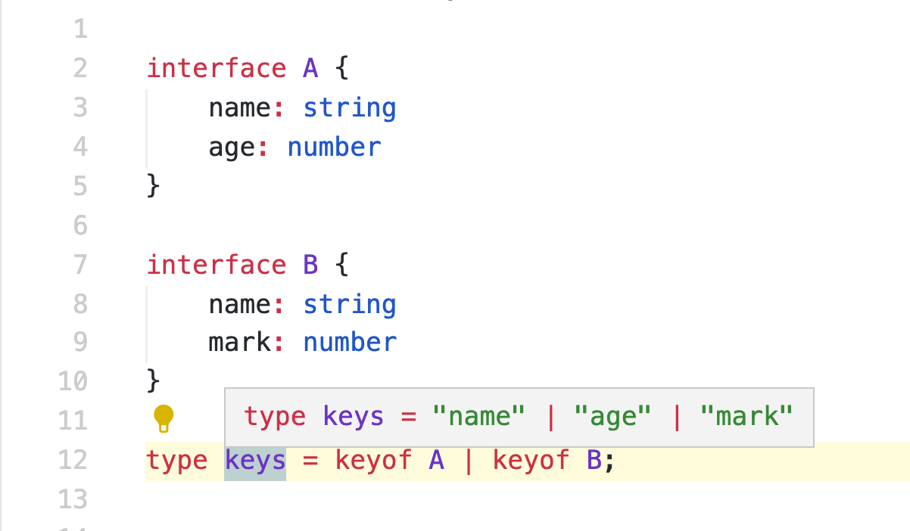

# Typescript

## keyof

keyof 与 Object.keys 略有相似，只不过 keyof 取 interface 的键。(币安面试题)



Array声明

定义一个数组，子元素类型既可以是对象，也可以是数组。（币安面试题）

```typescript
interface P {
    name: string
    age: number
}

export const arr: Array<Array<P>|P> = [[{ name: 'a', age: 12 }], { name: 'b', age: 10 }]
```

